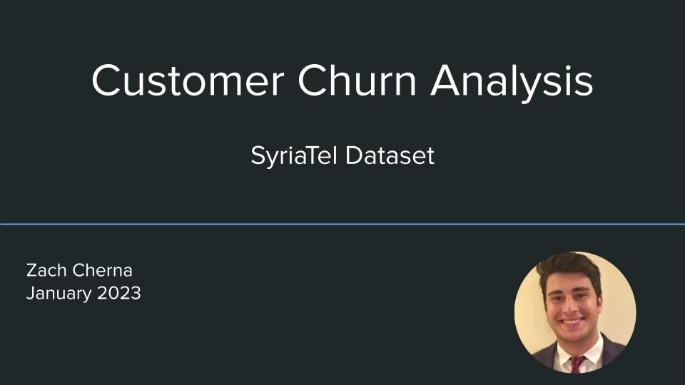
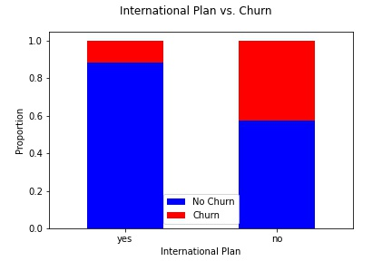

# Overview

The purpose of this project is to build a predictive model that will enable SyriaTel, a Telecommunications company, to better understand customer churn and leverage the insights of data to make smarter decisions. Ultimately, their goal is to increase profits by reducing customer churn. At the end of my analysis, I present concrete recommendations to reduce customer churn based on my findings and discuss next steps for deployment of the predictive model going forward. 
# Business Understanding
It is well understood that the cost to acquire new customers is significantly more expensive than the cost to keep current customers. Therefore, customer churn - the turnover rate of customers, is a crucial metric that organizations must seek to minimize. This is especially true now at the time of my analysis, January 2023,  due to rising interest rates and high inflation. The challenging economic environment forces customers to be even more selective about spending money and businesses will be under greater pressure. In order to minimize churn, organizations need to first gain a deep understanding of how customers feel about the products and services they offer and identify which customers are most at risk of leaving. Armed with those insights, the organization can then act strategically to keep their customers satisfied and reduce churn. 
# Data Understanding
For my analysis I used the SyriaTel dataset, which contains churn data for over 3,300 telecom customers. This dataset also contains customer attributes such as how much were they paying, how many minutes were used, did the customer have an international plan, and a number of other attributes as well.  My reason for building a predictive model is to solve what is known in data science as a classification problem. I want my model to learn from customer data and accurately classify future customers as falling into two binary groups:
Likely to 1.) Churn  2.) Not churn.  
# Exploratory Data Analysis
I began my EDA with data cleaning and visualizations to better understand the relationships between Churn and various customer attributes. 
The first thing I wanted to understand was the distribution of my target variable, churn.

As visualized in the chart, the churn rate is just about 15%. This implies the dataset is disproportionate in that it has substantially more samples of customers without churn than customers with churn. Later in my analysis, I utilize SMOTE as an oversampling technique to account for this class imbalance. 

I then sought to visualize the distribution of the numeric data by creating a pair plot.

With the exception of the 'area_code' and 'number_vmail_messages' columns, you can see how the data is normally distributed. There is also a strong positive linear relationship between 'total_day_minutes' and 'total_day_charge'; 'total_eve_minutes' and 'total_eve_charge"; 'total_night_minutes' and 'total_night_charge'; 'total_intl_calls' and 'total_intl_charge'. This may present an opportunity for feature engineering later on.

I then created a number of additional visualizations which can be viewed in the jupyter notebook, but the one that stood out the most to me was the the countplot that showed the proportion of customer churn given the presence or absence of an International Plan.

Starting on the left with customers who were signed up for plan, churn rate is only about 10%. Whereas on the right for customers who did not have a plan, churn rate is about 40%. This 30% decrease in churn tells me that the International Plan may be a great service that customers like and may be worth looking deeper into.

# Feature Engineering
As I mentioned when discussing the pairplot, there is a strong positive linear relationship between many of the features in the dataset as well as potential redundancy. For example, there are separate columns for "daytime calls", "evening calls", and "night calls". In order to visualize the aggregate of these features, I performed feature engineering. The histogram below is one example of the visualizations I created to examine the aggregate of a number of customer attribute features.

What stood out to me about this plot is you can see clearly that as total aggregate charge approaches that $75 mark, customer churn starts to surpass customer retention. This indicates that customers have limits on how much they're willing to pay. Churn increases for high paying customers.

# Modeling
The first step in my modeling process was to perform data preprocessing. I created a numeric pipeline to StandardScale numeric data, a categorical pipeline to OneHotEncode categorical data, and a target pipeline to LabelEncode my target, Churn. I then instantiated a column transformer containing these three mini pipelines. My next step was to assign variables to my predictors and target, and then split the data into a training and test set. To easily obtain cross validation scores and visualize my models, I imported the "ModelWithCV()" class provided by Flatiron which used 10 as the kfolds parameter. 

My goal for constructing the best model was to create a few simple, parametric and non-parametric models,  find the top two based on accuracy, and then fine-tune those selected to try and optimize for accuracy. The folllwing results contain the accuracy scores for the simple models:
LogisticRegression: Crossval train score : 85.91% ; test score: 85.73%
DecisionTreeClassifier: Crossval train score: 90.95%; test score: 92.56%
RandomForestClassifier: Crossval train score: 93.83% ; test score: 94.24%
GradientBoostingClassifier:Crossval train score: 94.91%; test score: 94.96%

Below is a visualization of the crossval train score for the simple GradientBoosting Classifier. The violin plot shows a graphic representation of the target and the swarm plot shows the dots which represent the cross validation.

The top two models, RandomForest and GradientBoosting, are good as is given lack of overfitting and high accuracy scores. However, I wanted to see if improvements could be made. As I mentioned earlier, there is a class imbalance in this dataset. To account for this, I use the SMOTE oversampling technnique along with IMBPipeline to see if it would make a difference. The following are the accuracy scores:
RandomForest with SMOTE: train: 1.0 ; test: 93.64%
GradientBoosting with Smote: train: 95.79%; test: 94.48%

I then utilized GridSearch in order to perform hyperparameter tuning. The best parameters I ended up using could be found in the jupyter notebook. The following are the accuracy scores with hyperparameter tuning:
RandomForest with GridSearch: train: 1.0; test: 94.12%
GradientBoosting with GridSearch: train: 1.0; test: 95.80%

GradientBoosting appears to be the best model. Below is a visualization of its confusion matrix which enables you to understand the models errors. The square with '9' represents false positives and the square with '26' represents false negatives. 

# Final Evaluation

For my stakeholder, identifying future customers who may churn is criticial to their ability to target market and try to retain customers. For this reason, I think that accuracy is the most important metric becasue it measures the rate at which the model can correctly predict whether or not a customer will churn. Despite this, I did decide to look at other key metrics as well for added reassurance as to which model is best overall. ROC_AUC is a measurement of the ratio of the rate of True Positive to False postive, with a higher score being better. Gradient Boost had a score of 0.93 while Random Forest had a slightly better score of 0.94. Additional metrics I used include precision, which measures what proportion of positive identifications was actually correct? Recall, which measures what proportion of actual positives was identified correctly? Finally, I measured F1 score, which is a combination of both precision and recall. The results for Gradient Boost are as follows: Recall: 79%, Precision: 92%, F1 Score: 85%. The results for Random Forest are as follows: Recall: 69%, Precision: 90%, F1 Score: 78%. When comparing these metric scores between the two top models, the Gradient Boost was superior in each category, giving me even more assurance that it is indeed the best model. When comparing the final model to the baseline model which had an accuracy score of about 86%, it's clear that this it is a major improvement and should be utilized in the future as a tool to effecetively predict customer churn.

# Recommendations

In the near-term, I have two recommendations based on key findings. First thing is to utilize target marketing to find customers who will sign up for the international plan. The data is clear that churn rate for those customers is about 30% lower than it is for customers who are not on that service.

My second recommendation is to incentivize your high activity users and find a way to lower their costs. We saw that once total charge hit that $75 mark, customer churn started to surpass retention. So I would consider implementing something like a flat-fee program that’ll be attractive to those active users. 

# Next Steps

My long-term recommendation is to deploy the model I created. With an accuracy score of 96%, precision score of 92%, and ROC-AUC of 0.93, the model may serve as a powerful tool to identify customer churn. As I mentioned earlier, if you know that certain customers have a higher likelihood of leaving and you also have a sense for the reason, you could focus your resources on that specific group and be proactive about alleviating their concerns and keeping them happy.
To that extent, I’d like to collect more data and fine tune the model even more.
Having as much data as possible will strengthen the model, and ultimately strengthen the organizations ability to reduce customer churn, save money, and make better decisions. 

**For additional info, contact:**
- Zach Cherna: zacharycherna@gmail.com
